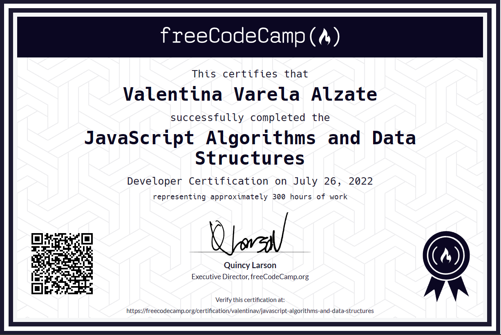
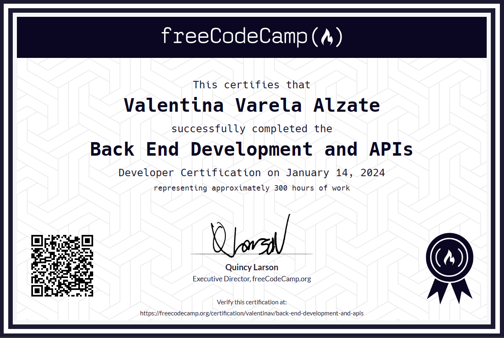
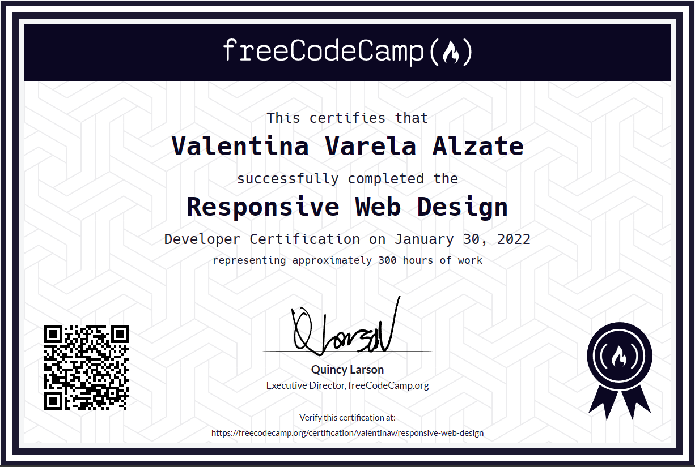

# 🛠️ Software Craftsmanship

> *"Any fool can write code that a computer can understand. Good programmers write code that humans can understand."* — Martin Fowler

Personal knowledge base for software engineering — courses, reference notes, coding challenges, and reusable prompts.

---

## 📂 Structure

```
software-craftsmanship/
├── 📚 courses/          structured study from courses & books
├── 🧠 notes/            personal technical reference
├── ⚔️  challenges/       solved coding exercises
├── 💬 prompts/          reusable AI prompts
└── 🏅 certifications/   earned certifications
```

---

## 📚 Courses

| Course | Source | Status |
|---|---|---|
| [Data Structures & Algorithms](./courses/dsa/) | University of Helsinki | 🚧 In progress |
| [Writing Clean Code: 20 Code Smells](./courses/clean-code/) | Packt / Coursera | ✅ Complete |
| [Back End Development and APIs](./courses/backend-apis/) | freeCodeCamp | ✅ Complete |
| [Responsive Web Design](./courses/responsive-web/) | freeCodeCamp | ✅ Complete |

---

## 🧠 Notes

Self-structured reference on CS fundamentals — built from problem-solving, docs, and work experience.

- [`algorithms/`](./notes/algorithms/) — sorting, searching, and graph/tree traversal
- [`data-structures/`](./notes/data-structures/) — notes on representation, operations, and tradeoffs
- [`patterns/`](./notes/patterns/) — prefix sums, sliding windows, greedy, backtracking, and dynamic programming

---

## ⚔️ Challenges

Solved exercises in Python and JavaScript — algorithmic problems, string manipulation, data processing.

→ [`challenges/`](./challenges/)

---

## 🏅 Certifications

<p>
  
  
  
  
  
  
</p>

---

## 🛠️ Tech


