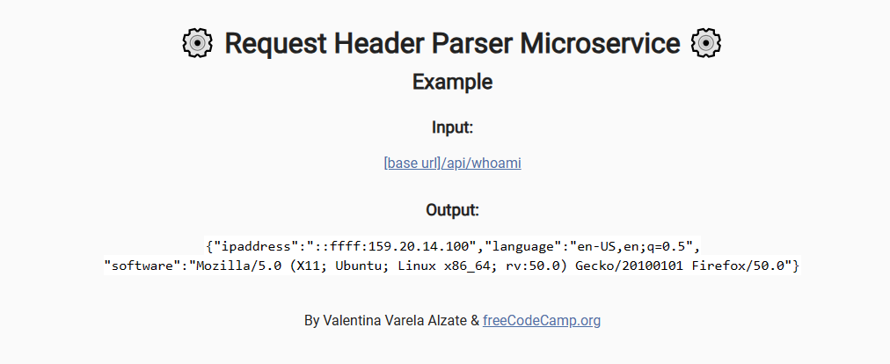
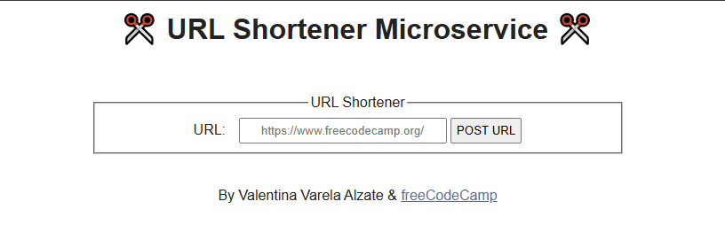
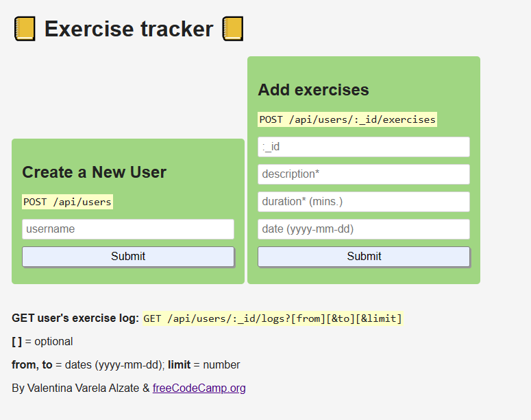
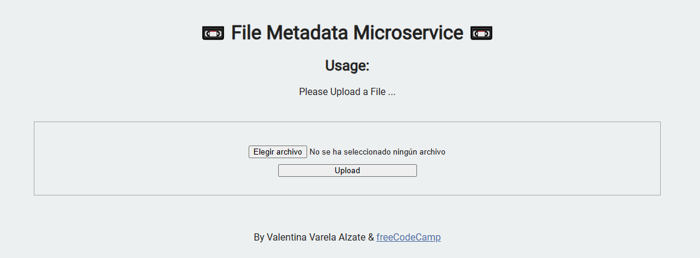

# Back End Development and APIs - freeCodeCamp

> **Source:** https://www.freecodecamp.org/learn/back-end-development-and-apis/
> **Status:** ✅ Complete

## Projects

### 1. Timestamp Microservice
Full stack JavaScript app for a Timestamping Service that can interpret and generate timestamps in specific formats.

[Solution](./timestamp-service) · 

### 2. Request Header Parser Microservice
Parse service for a request header — returns ip, language, and software from the request.

[Solution](./request-header-parser-service) · 

### 3. URL Shortener Microservice
Service that allows shortening a URL.

[Solution](./url-shortener-service) · 

### 4. Exercise Tracker Service
Web application to create users, register exercises, and retrieve exercise lists per user.

[Solution](./exercise-tracker-service) · 

### 5. File Metadata Service
Service to upload files, store them, and obtain relevant metadata.

[Solution](./filemetadata-service) · 
