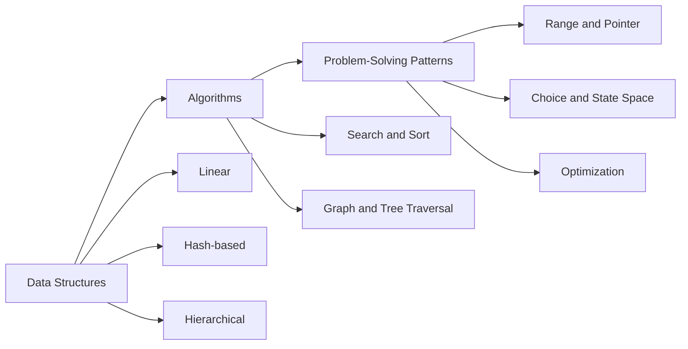

# 🧠 Notes

> Ideas, technical references, and lessons I want to keep close.

This is where I collect ideas, things I learned while solving a problem, reading documentation, working on a project, or following a question until it made sense. The current collection leans toward computer science, but the folder is intentionally broader than that.

At the moment, I organize the technical material around three questions:

| Question I am answering | Collection | What I want to remember |
| --- | --- | --- |
| **How should I represent the data?** | [Data Structures](#data-structures) | The tradeoffs behind storing and accessing information |
| **What procedure fits the operation?** | [Algorithms](#algorithms) | The invariants behind searching, sorting, and traversing |
| **What familiar shape does this have?** | [Patterns](#problem-solving-patterns) | Reusable ways of reasoning about a problem |

---

## 🗺️ How I Connect the Ideas

My usual path is representation first, operation second, and pattern last. It helps me separate what the data is from what I need to do with it. I keep the same anatomy in these notes so I can return to an idea quickly: intuition, recognition cues, a generic Python base, adaptations, complexity, and mistakes I have to watch for.

---

## Data Structures

The foundation: how data is laid out, accessed, updated, and connected.

| # | Guide | Core idea |
| ---: | --- | --- |
| 01 | [Strings](data-structures/1.strings.md) | Sequences of characters, parsing, and frequency analysis |
| 02 | [Arrays](data-structures/2.arrays.md) | Indexed storage and contiguous processing |
| 03 | [Linked Lists](data-structures/3.linked-lists.md) | Node-based sequences and pointer updates |
| 04 | [Hash Maps](data-structures/4.hash-maps.md) | Fast lookup, counting, and grouping |
| 05 | [Stacks & Queues](data-structures/5.stacks-and-queues.md) | LIFO and FIFO processing order |
| 06 | [Trees](data-structures/6.trees.md) | Hierarchical relationships and recursive structure |
| 07 | [Graphs](data-structures/7.graphs.md) | General relationships, paths, and connectivity |
| 08 | [Sets](data-structures/8.sets.md) | Membership, uniqueness, and set operations |
| 09 | [Heaps & Priority Queues](data-structures/9.heaps-and-priority-queues.md) | Efficient access to the next priority |
| 10 | [Deques](data-structures/10.deques.md) | Constant-time work at both ends |
| 11 | [Tries](data-structures/11.tries.md) | Prefix-oriented string storage |
| 12 | [Union-Find](data-structures/12.union-find.md) | Dynamic connectivity and component tracking |

---

## Algorithms

My references for concrete procedures, with the invariants and tradeoffs I tend to forget first.

| # | Note | What brings me back to it |
| ---: | --- | --- |
| 01 | [Insertion Sort](algorithms/1.insertion_sort.md) | The input is small or nearly sorted |
| 02 | [Binary Search](algorithms/2.binary_search.md) | A monotonic condition divides the search space |
| 03 | [Merge Sort](algorithms/3.merge_sort.md) | Stability and predictable $O(n \log n)$ time matter |
| 04 | [Quick Sort](algorithms/4.quick_sort.md) | In-place average-case performance matters |
| 05 | [Breadth-First Search](algorithms/5.bfs.md) | Distance is measured in unweighted edges |
| 06 | [Depth-First Search](algorithms/6.dfs.md) | Complete exploration or dependency ordering matters |
| 07 | [Tree Search](algorithms/7.tree_search.md) | Hierarchy or BST ordering narrows the search |

---

## Problem-Solving Patterns

Problem shapes I have seen more than once. I keep a generic template first, then a couple of adaptations that make the underlying invariant easier to recognize.

| # | Guide | Recognition cue |
| ---: | --- | --- |
| 01 | [Prefix Sum](patterns/1.prefix_sum.md) | Many immutable range queries |
| 02 | [Two Pointers](patterns/2.two_pointers.md) | Two coordinated positions shrink the search space |
| 03 | [Sliding Window](patterns/3.sliding_window.md) | A contiguous valid region grows and shrinks |
| 04 | [Generators](patterns/4.generators.md) | Values should be produced lazily |
| 05 | [Greedy](patterns/5.greedy.md) | A provably safe local choice builds the answer |
| 06 | [Backtracking](patterns/6.backtracking.md) | Choose, explore, and undo across a state space |
| 07 | [Memoization](patterns/7.memoization.md) | Recursive states repeat |
| 08 | [Dynamic Programming](patterns/8.dynamic_programming.md) | State transitions combine overlapping results |

---

## 📐 How I Write These Notes

I use the same five-part structure because it makes the collection easier for me to scan later:

1. **Mental model** — how I understand the idea and its invariant.
2. **Recognition cues** — the details that usually remind me of it.
3. **Python templates** — a generic base I can adapt, followed by common variations.
4. **Complexity** — the time, space, and practical tradeoffs worth remembering.
5. **Common mistakes** — the assumptions and implementation details I want to recheck.

> **My filing rule:** material tied to a course stays in [`../courses/`](../courses/). Everything else I want to revisit can live here, whether it comes from work, documentation, experiments, reading, or independent study.
