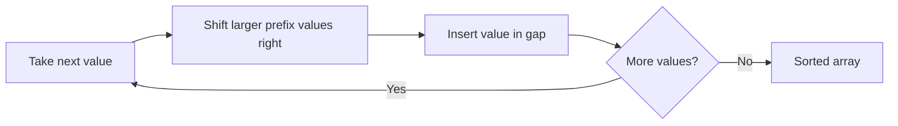

# Insertion Sort

## 1. Core idea

Insertion sort grows a sorted prefix one value at a time. Each new value moves left until it reaches its correct position.

```text
[5 | 2, 4, 6, 1, 3]
[2, 5 | 4, 6, 1, 3]
[2, 4, 5 | 6, 1, 3]
[2, 4, 5, 6 | 1, 3]
[1, 2, 4, 5, 6 | 3]
[1, 2, 3, 4, 5, 6]
```



## 2. Invariant and behavior

Before iteration $i$, the prefix `values[0:i]` is sorted. Shifting instead of swapping preserves the relative order of equal values, so the algorithm is stable.

| Property | Value |
| --- | --- |
| In place | Yes |
| Stable | Yes |
| Adaptive | Yes; fast on nearly sorted data |
| Main operation | Shift larger values right |

## 3. Generic template and common adaptations

### Generic template

The `key` callback separates the sorting algorithm from the type of value being sorted.

```python
from collections.abc import Callable, MutableSequence
from typing import TypeVar

T = TypeVar("T")
K = TypeVar("K")


def insertion_sort(values: MutableSequence[T], key: Callable[[T], K]) -> None:
    for index in range(1, len(values)):
        current = values[index]
        position = index - 1

        while position >= 0 and key(values[position]) > key(current):
            values[position + 1] = values[position]
            position -= 1

        values[position + 1] = current
```

### Common adaptation 1: sort records by one field

```python
def insertion_sort(values, key):
    for index in range(1, len(values)):
        current = values[index]
        position = index - 1
        while position >= 0 and key(values[position]) > key(current):
            values[position + 1] = values[position]
            position -= 1
        values[position + 1] = current


records = [("task-b", 2), ("task-a", 1), ("task-c", 2)]
insertion_sort(records, key=lambda record: record[1])
print(records)  # [('task-a', 1), ('task-b', 2), ('task-c', 2)]
```

### Common adaptation 2: sort only a small range

This variation is useful as the base case of a hybrid merge sort or quick sort.

```python
def insertion_sort_range(values: list[int], low: int, high: int) -> None:
    for index in range(low + 1, high + 1):
        current = values[index]
        position = index - 1
        while position >= low and values[position] > current:
            values[position + 1] = values[position]
            position -= 1
        values[position + 1] = current


numbers = [9, 5, 3, 4, 8]
insertion_sort_range(numbers, 1, 3)
print(numbers)  # [9, 3, 4, 5, 8]
```

## 4. Complexity and use cases

| Case | Time |
| --- | ---: |
| Already sorted | $O(n)$ |
| Average | $O(n^2)$ |
| Reverse sorted | $O(n^2)$ |
| Extra space | $O(1)$ |

Use insertion sort for small inputs, nearly sorted data, or as the base case inside a hybrid sorting algorithm. Prefer Python's built-in `sorted` for general application code.

## 5. Common mistakes

- Overwriting `current` before saving it.
- Stopping at `position > 0` instead of `position >= 0`.
- Using `>=` in the comparison and unintentionally losing stability.
- Expecting good performance on large reverse-sorted inputs.
