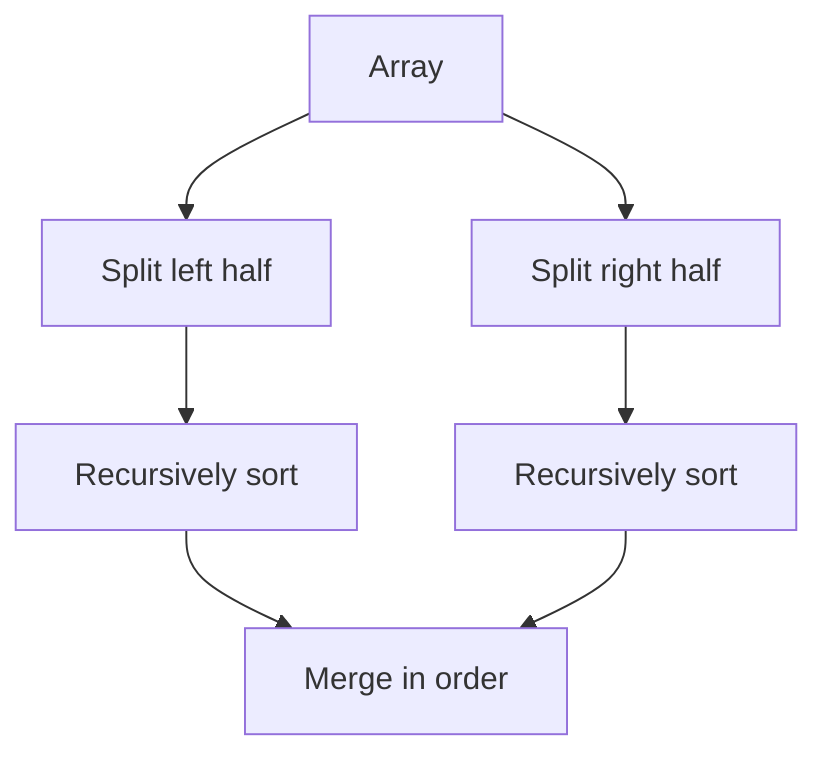

# Merge Sort

## 1. Core idea

Merge sort divides the input until every piece has one element, then merges sorted pieces.

```text
                 [8, 3, 2, 9, 7, 1]
                 /                \
          [8, 3, 2]             [9, 7, 1]
          /      \              /      \
       [8]      [3, 2]       [9]      [7, 1]
                 /  \                   /  \
               [3]  [2]               [7]  [1]
                 \  /                   \  /
                [2, 3]                 [1, 7]
          \       /              \       /
          [2, 3, 8]              [1, 7, 9]
                 \                /
                 [1, 2, 3, 7, 8, 9]
```



## 2. Invariant and behavior

During merging, the output contains the smallest consumed values in sorted order. Comparing with `<=` takes equal values from the left first and keeps the sort stable.

| Property | Value |
| --- | --- |
| Stable | Yes |
| Divide and conquer | Yes |
| In place | No in the standard array implementation |
| Predictable worst case | $O(n \log n)$ |

## 3. Generic template and common adaptations

### Generic template

```python
from collections.abc import Callable, Sequence
from typing import TypeVar

T = TypeVar("T")
K = TypeVar("K")


def merge_sort(values: Sequence[T], key: Callable[[T], K]) -> list[T]:
    if len(values) <= 1:
        return list(values)

    middle = len(values) // 2
    left = merge_sort(values[:middle], key)
    right = merge_sort(values[middle:], key)
    merged = []
    first = second = 0

    while first < len(left) and second < len(right):
        if key(left[first]) <= key(right[second]):
            merged.append(left[first])
            first += 1
        else:
            merged.append(right[second])
            second += 1

    return merged + left[first:] + right[second:]
```

### Common adaptation 1: stable record sorting

```python
def merge_sort_records(records: list[tuple[str, int]]) -> list[tuple[str, int]]:
    if len(records) <= 1:
        return records[:]
    middle = len(records) // 2
    left = merge_sort_records(records[:middle])
    right = merge_sort_records(records[middle:])
    result = []
    first = second = 0

    while first < len(left) and second < len(right):
        if left[first][1] <= right[second][1]:
            result.append(left[first])
            first += 1
        else:
            result.append(right[second])
            second += 1
    return result + left[first:] + right[second:]


records = [("B", 2), ("A", 1), ("C", 2)]
print(merge_sort_records(records))  # [('A', 1), ('B', 2), ('C', 2)]
```

### Common adaptation 2: count inversions

```python
def count_inversions(values: list[int]) -> tuple[list[int], int]:
    if len(values) <= 1:
        return values[:], 0
    middle = len(values) // 2
    left, left_count = count_inversions(values[:middle])
    right, right_count = count_inversions(values[middle:])
    merged, split_count = [], 0
    first = second = 0

    while first < len(left) and second < len(right):
        if left[first] <= right[second]:
            merged.append(left[first])
            first += 1
        else:
            merged.append(right[second])
            second += 1
            split_count += len(left) - first
    merged.extend(left[first:])
    merged.extend(right[second:])
    return merged, left_count + right_count + split_count


print(count_inversions([2, 4, 1, 3, 5])[1])  # 3
```

## 4. Complexity and use cases

| Measure | Complexity |
| --- | ---: |
| Best, average, worst time | $O(n \log n)$ |
| Merge space | $O(n)$ |
| Recursion stack | $O(\log n)$ |

Use merge sort when stability and predictable worst-case time matter, when merging streams or linked lists, and as the foundation for counting inversions.

## 5. Common mistakes

- Forgetting the base case for arrays of length zero or one.
- Omitting remaining elements after one half is exhausted.
- Using `<` instead of `<=` when stability matters.
- Assuming array slicing is free; it allocates additional lists in Python.
