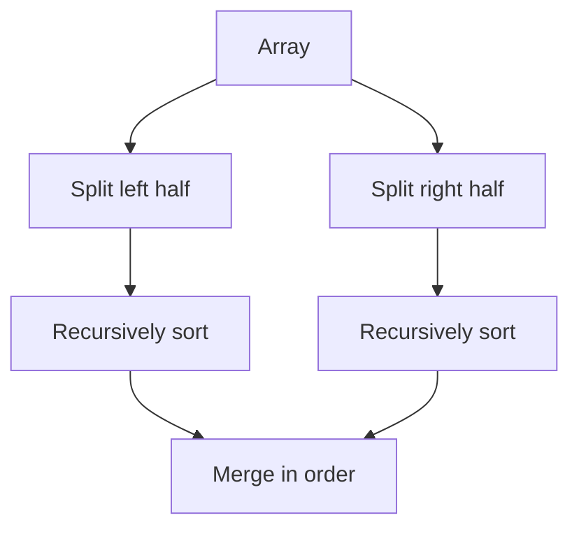

# Merge Sort

## 1. Core idea

Merge sort divides the input until every piece has one element, then merges sorted pieces.

```text
                 [8, 3, 2, 9, 7, 1]
                 /                \
          [8, 3, 2]             [9, 7, 1]
          /      \              /      \
       [8]      [3, 2]       [9]      [7, 1]
                 /  \                   /  \
               [3]  [2]               [7]  [1]
                 \  /                   \  /
                [2, 3]                 [1, 7]
          \       /              \       /
          [2, 3, 8]              [1, 7, 9]
                 \                /
                 [1, 2, 3, 7, 8, 9]
```



## 2. Invariant and behavior

During merging, the output contains the smallest consumed values in sorted order. Comparing with `<=` takes equal values from the left first and keeps the sort stable.

| Property | Value |
| --- | --- |
| Stable | Yes |
| Divide and conquer | Yes |
| In place | No in the standard array implementation |
| Predictable worst case | $O(n \log n)$ |

## 3. Python template

```python
def merge_sort(values: list[int]) -> list[int]:
    if len(values) <= 1:
        return values[:]

    middle = len(values) // 2
    left = merge_sort(values[:middle])
    right = merge_sort(values[middle:])
    return merge(left, right)


def merge(left: list[int], right: list[int]) -> list[int]:
    merged = []
    left_index = right_index = 0

    while left_index < len(left) and right_index < len(right):
        if left[left_index] <= right[right_index]:
            merged.append(left[left_index])
            left_index += 1
        else:
            merged.append(right[right_index])
            right_index += 1

    merged.extend(left[left_index:])
    merged.extend(right[right_index:])
    return merged


print(merge_sort([8, 3, 2, 9, 7, 1]))  # [1, 2, 3, 7, 8, 9]
```

The merge operation is also useful independently:

```python
def merge_sorted(left: list[int], right: list[int]) -> list[int]:
    result = []
    first = second = 0
    while first < len(left) and second < len(right):
        if left[first] <= right[second]:
            result.append(left[first])
            first += 1
        else:
            result.append(right[second])
            second += 1
    return result + left[first:] + right[second:]


print(merge_sorted([1, 4, 8], [2, 3, 9]))  # [1, 2, 3, 4, 8, 9]
```

## 4. Complexity and use cases

| Measure | Complexity |
| --- | ---: |
| Best, average, worst time | $O(n \log n)$ |
| Merge space | $O(n)$ |
| Recursion stack | $O(\log n)$ |

Use merge sort when stability and predictable worst-case time matter, when merging streams or linked lists, and as the foundation for counting inversions.

## 5. Common mistakes

- Forgetting the base case for arrays of length zero or one.
- Omitting remaining elements after one half is exhausted.
- Using `<` instead of `<=` when stability matters.
- Assuming array slicing is free; it allocates additional lists in Python.
