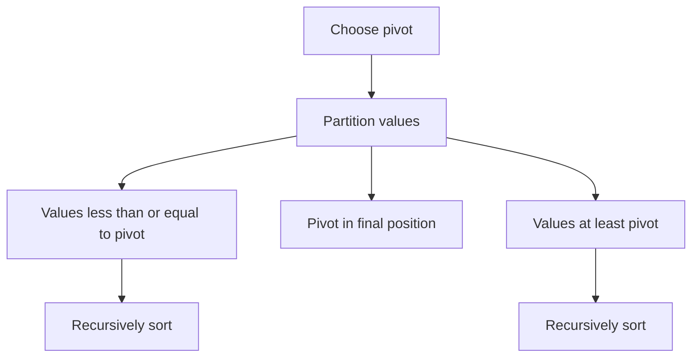

# Quick Sort

## 1. Core idea

Quick sort selects a pivot, partitions values around it, and recursively sorts both sides.

```text
[7, 2, 1, 6, 8, 5, 3, 4]   pivot = 4
             partition
[2, 1, 3]  [4]  [7, 6, 8, 5]
    sort            sort
[1, 2, 3]  [4]  [5, 6, 7, 8]
```



## 2. Invariant and behavior

In Lomuto partitioning, before each iteration:

- `values[low:boundary]` contains values smaller than or equal to the pivot.
- `values[boundary:index]` contains values greater than the pivot.
- The pivot remains at `high` until its final swap.

| Property | Value |
| --- | --- |
| In place | Yes, excluding recursion stack |
| Stable | No |
| Average performance | $O(n \log n)$ |
| Worst case | $O(n^2)$ |

## 3. Python template

```python
def quick_sort(values: list[int]) -> list[int]:
    def partition(low: int, high: int) -> int:
        pivot = values[high]
        boundary = low

        for index in range(low, high):
            if values[index] <= pivot:
                values[boundary], values[index] = values[index], values[boundary]
                boundary += 1

        values[boundary], values[high] = values[high], values[boundary]
        return boundary

    def sort(low: int, high: int) -> None:
        if low >= high:
            return
        pivot_index = partition(low, high)
        sort(low, pivot_index - 1)
        sort(pivot_index + 1, high)

    sort(0, len(values) - 1)
    return values


print(quick_sort([7, 2, 1, 6, 8, 5, 3, 4]))
```

Randomizing the pivot reduces the chance of consistently unbalanced partitions:

```python
from random import randrange


def choose_random_pivot(values: list[int], low: int, high: int) -> None:
    pivot_index = randrange(low, high + 1)
    values[pivot_index], values[high] = values[high], values[pivot_index]


values = [3, 1, 2]
choose_random_pivot(values, 0, len(values) - 1)
print(sorted(values))  # [1, 2, 3]
```

## 4. Complexity and use cases

| Case | Time | Stack space |
| --- | ---: | ---: |
| Balanced partitions | $O(n \log n)$ | $O(\log n)$ |
| Average | $O(n \log n)$ | $O(\log n)$ expected |
| Worst, unbalanced | $O(n^2)$ | $O(n)$ |

Quick sort is useful for in-place sorting and partition-based selection. In Python production code, prefer the stable built-in `sorted`, which is highly optimized.

## 5. Common mistakes

- Recursing over the pivot again instead of excluding it.
- Losing values while swapping in place.
- Always choosing a poor pivot for sorted or adversarial input.
- Claiming that quick sort is stable.
- Ignoring Python's recursion-depth limit on unbalanced inputs.
