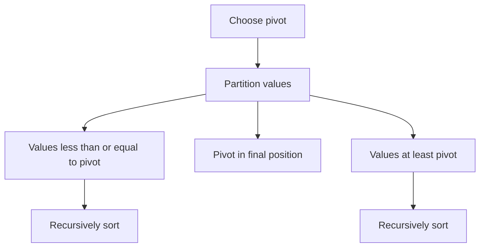

# Quick Sort

## 1. How I think about it

Quick sort selects a pivot, partitions values around it, and recursively sorts both sides.

```text
[7, 2, 1, 6, 8, 5, 3, 4]   pivot = 4
             partition
[2, 1, 3]  [4]  [7, 6, 8, 5]
    sort            sort
[1, 2, 3]  [4]  [5, 6, 7, 8]
```



## 2. What I need to preserve

In Lomuto partitioning, before each iteration:

- `values[low:boundary]` contains values smaller than or equal to the pivot.
- `values[boundary:index]` contains values greater than the pivot.
- The pivot remains at `high` until its final swap.

| Property | Value |
| --- | --- |
| In place | Yes, excluding recursion stack |
| Stable | No |
| Average performance | $O(n \log n)$ |
| Worst case | $O(n^2)$ |

## 3. My reusable base and common adaptations

### Generic template

```python
from collections.abc import Callable, MutableSequence
from typing import TypeVar

T = TypeVar("T")
K = TypeVar("K")


def quick_sort(values: MutableSequence[T], key: Callable[[T], K]) -> None:
    def partition(low: int, high: int) -> int:
        pivot_key = key(values[high])
        boundary = low
        for index in range(low, high):
            if key(values[index]) <= pivot_key:
                values[boundary], values[index] = values[index], values[boundary]
                boundary += 1
        values[boundary], values[high] = values[high], values[boundary]
        return boundary

    def sort(low: int, high: int) -> None:
        if low < high:
            pivot = partition(low, high)
            sort(low, pivot - 1)
            sort(pivot + 1, high)

    sort(0, len(values) - 1)
```

### Common adaptation 1: randomized pivot

```python
from random import randrange


def randomized_quick_sort(values: list[int]) -> None:
    def sort(low: int, high: int) -> None:
        if low >= high:
            return
        pivot_index = randrange(low, high + 1)
        values[pivot_index], values[high] = values[high], values[pivot_index]
        pivot, boundary = values[high], low
        for index in range(low, high):
            if values[index] <= pivot:
                values[boundary], values[index] = values[index], values[boundary]
                boundary += 1
        values[boundary], values[high] = values[high], values[boundary]
        sort(low, boundary - 1)
        sort(boundary + 1, high)

    sort(0, len(values) - 1)


numbers = [7, 2, 1, 6, 8, 5, 3, 4]
randomized_quick_sort(numbers)
print(numbers)  # [1, 2, 3, 4, 5, 6, 7, 8]
```

### Common adaptation 2: three-way partition for duplicates

```python
def three_way_quick_sort(values: list[int], low: int, high: int) -> None:
    if low >= high:
        return
    pivot = values[low]
    smaller, index, larger = low, low + 1, high

    while index <= larger:
        if values[index] < pivot:
            values[smaller], values[index] = values[index], values[smaller]
            smaller += 1
            index += 1
        elif values[index] > pivot:
            values[index], values[larger] = values[larger], values[index]
            larger -= 1
        else:
            index += 1

    three_way_quick_sort(values, low, smaller - 1)
    three_way_quick_sort(values, larger + 1, high)


numbers = [3, 1, 3, 2, 3, 1]
three_way_quick_sort(numbers, 0, len(numbers) - 1)
print(numbers)  # [1, 1, 2, 3, 3, 3]
```

## 4. Complexity and where I use it

| Case | Time | Stack space |
| --- | ---: | ---: |
| Balanced partitions | $O(n \log n)$ | $O(\log n)$ |
| Average | $O(n \log n)$ | $O(\log n)$ expected |
| Worst, unbalanced | $O(n^2)$ | $O(n)$ |

I keep quick sort in mind for in-place sorting and partition-based selection. In Python production code, I prefer the stable and highly optimized built-in `sorted`.

## 5. Mistakes I watch for

- Recursing over the pivot again instead of excluding it.
- Losing values while swapping in place.
- Always choosing a poor pivot for sorted or adversarial input.
- Claiming that quick sort is stable.
- Ignoring Python's recursion-depth limit on unbalanced inputs.
