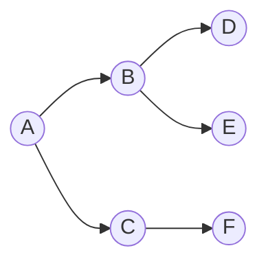

# Breadth-First Search (BFS)

## 1. How I think about it

BFS explores a graph level by level. A FIFO queue ensures that vertices reached with fewer edges are processed first.

```text
        A
      /   \
     B     C
    / \     \
   D   E     F

queue: [A] -> [B,C] -> [C,D,E] -> [D,E,F]
order:  A, B, C, D, E, F
```



## 2. What I need to preserve

When a vertex leaves the queue, its shortest distance in number of edges is known for an unweighted graph. Mark vertices visited when enqueuing them, not when removing them.

| Structure | Purpose |
| --- | --- |
| Queue | Preserve level order |
| Visited set | Prevent repeated work and cycles |
| Distance map | Store minimum edge count |
| Parent map | Reconstruct a shortest path |

## 3. My reusable base and common adaptations

### Generic template

The `neighbors` callback lets the same traversal work with adjacency lists, trees, grids, or generated states.

```python
from collections import deque
from collections.abc import Callable, Iterable
from typing import TypeVar

T = TypeVar("T")


def bfs(start: T, neighbors: Callable[[T], Iterable[T]]) -> tuple[list[T], dict[T, int]]:
    queue = deque([start])
    distance = {start: 0}
    order = []

    while queue:
        node = queue.popleft()
        order.append(node)
        for neighbor in neighbors(node):
            if neighbor not in distance:
                distance[neighbor] = distance[node] + 1
                queue.append(neighbor)

    return order, distance
```

### Common adaptation 1: shortest unweighted path

```python
from collections import deque


def shortest_path(graph: dict[str, list[str]], start: str, target: str) -> list[str]:
    queue = deque([start])
    parent = {start: None}

    while queue:
        node = queue.popleft()
        if node == target:
            path = []
            while node is not None:
                path.append(node)
                node = parent[node]
            return path[::-1]
        for neighbor in graph[node]:
            if neighbor not in parent:
                parent[neighbor] = node
                queue.append(neighbor)
    return []


graph = {"A": ["B", "C"], "B": ["D"], "C": ["D"], "D": ["E"], "E": []}
print(shortest_path(graph, "A", "E"))  # ['A', 'B', 'D', 'E']
```

### Common adaptation 2: multi-source BFS

```python
from collections import deque


def distance_to_nearest_source(graph: dict[int, list[int]], sources: list[int]) -> dict[int, int]:
    queue = deque(sources)
    distance = {source: 0 for source in sources}

    while queue:
        node = queue.popleft()
        for neighbor in graph[node]:
            if neighbor not in distance:
                distance[neighbor] = distance[node] + 1
                queue.append(neighbor)
    return distance


graph = {0: [1], 1: [0, 2], 2: [1, 3], 3: [2, 4], 4: [3]}
print(distance_to_nearest_source(graph, [0, 4]))  # {0: 0, 4: 0, 1: 1, 3: 1, 2: 2}
```

## 4. Complexity and signals I look for

| Representation | Time | Extra space |
| --- | ---: | ---: |
| Adjacency list | $O(V + E)$ | $O(V)$ |
| Grid with $R \times C$ cells | $O(RC)$ | $O(RC)$ worst case |

I return to BFS for minimum moves in an unweighted graph, level-order tree traversal, nearest-target problems, and multi-source spreading simulations.

## 5. Mistakes I watch for

- Using `list.pop(0)`, which is $O(n)$; I use `collections.deque` instead.
- Marking visited too late and enqueuing the same node repeatedly.
- Using BFS for arbitrary weighted shortest paths.
- Forgetting to validate grid boundaries before enqueueing neighbors.
