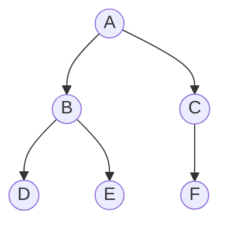

# Depth-First Search (DFS)

## 1. Core idea

DFS follows one path as deeply as possible before backtracking. It can use recursion or an explicit LIFO stack.

```text
        A
      /   \
     B     C
    / \     \
   D   E     F

one DFS order: A -> B -> D -> E -> C -> F
```



## 2. Invariant and behavior

The visited set prevents processing a vertex more than once. The recursive template marks a vertex when it is discovered; the iterative template below marks it when it is removed from the stack and may temporarily push duplicates.

| Form | Advantage | Risk |
| --- | --- | --- |
| Recursive | Concise and natural for trees | Python recursion limit |
| Iterative | Handles deep graphs | Neighbor order needs care |
| Three-color DFS | Detects directed cycles | More state per vertex |

## 3. Generic template and common adaptations

### Generic template

```python
from collections.abc import Callable, Iterable
from typing import TypeVar

T = TypeVar("T")


def dfs(start: T, neighbors: Callable[[T], Iterable[T]]) -> list[T]:
    visited = set()
    order = []

    def visit(node: T) -> None:
        visited.add(node)
        order.append(node)
        for neighbor in neighbors(node):
            if neighbor not in visited:
                visit(neighbor)

    visit(start)
    return order
```

### Common adaptation 1: directed cycle detection

```python
def has_directed_cycle(graph: dict[str, list[str]]) -> bool:
    state = {node: 0 for node in graph}  # 0=unvisited, 1=active, 2=finished

    def visit(node: str) -> bool:
        if state[node] == 1:
            return True
        if state[node] == 2:
            return False
        state[node] = 1
        if any(visit(neighbor) for neighbor in graph[node]):
            return True
        state[node] = 2
        return False

    return any(visit(node) for node in graph if state[node] == 0)


print(has_directed_cycle({"A": ["B"], "B": ["C"], "C": ["A"]}))  # True
```

### Common adaptation 2: topological ordering

```python
def topological_sort(graph: dict[str, list[str]]) -> list[str]:
    visited = set()
    order = []

    def visit(node: str) -> None:
        if node in visited:
            return
        visited.add(node)
        for neighbor in graph[node]:
            visit(neighbor)
        order.append(node)

    for node in graph:
        visit(node)
    return order[::-1]


graph = {"plan": ["code"], "code": ["test"], "test": []}
print(topological_sort(graph))  # ['plan', 'code', 'test']
```

## 4. Complexity and recognition

| Representation | Time | Extra space |
| --- | ---: | ---: |
| Adjacency list | $O(V + E)$ | $O(V)$ |
| Tree | $O(n)$ | $O(h)$ recursive stack |
| Grid | $O(RC)$ | $O(RC)$ worst case |

Use DFS for connected components, cycle detection, topological structure, flood fill, subtree calculations, and exhaustive path exploration.

## 5. Common mistakes

- Omitting `visited` in a graph with cycles.
- Confusing traversal order with shortest-path guarantees.
- Exceeding Python's recursion limit on a deep graph.
- Pushing neighbors in natural order when a specific iterative order requires reversing them.
