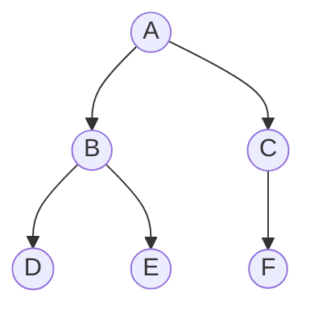

# Depth-First Search (DFS)

## 1. Core idea

DFS follows one path as deeply as possible before backtracking. It can use recursion or an explicit LIFO stack.

```text
        A
      /   \
     B     C
    / \     \
   D   E     F

one DFS order: A -> B -> D -> E -> C -> F
```



## 2. Invariant and behavior

The visited set prevents processing a vertex more than once. The recursive template marks a vertex when it is discovered; the iterative template below marks it when it is removed from the stack and may temporarily push duplicates.

| Form | Advantage | Risk |
| --- | --- | --- |
| Recursive | Concise and natural for trees | Python recursion limit |
| Iterative | Handles deep graphs | Neighbor order needs care |
| Three-color DFS | Detects directed cycles | More state per vertex |

## 3. Python templates

```python
def dfs_recursive(graph: dict[str, list[str]], start: str) -> list[str]:
    visited = set()
    order = []

    def visit(node: str) -> None:
        visited.add(node)
        order.append(node)
        for neighbor in graph[node]:
            if neighbor not in visited:
                visit(neighbor)

    visit(start)
    return order


graph = {"A": ["B", "C"], "B": ["D", "E"], "C": ["F"], "D": [], "E": [], "F": []}
print(dfs_recursive(graph, "A"))  # ['A', 'B', 'D', 'E', 'C', 'F']
```

```python
def dfs_iterative(graph: dict[str, list[str]], start: str) -> list[str]:
    stack = [start]
    visited = set()
    order = []

    while stack:
        node = stack.pop()
        if node in visited:
            continue
        visited.add(node)
        order.append(node)
        stack.extend(reversed(graph[node]))

    return order


graph = {"A": ["B", "C"], "B": ["D", "E"], "C": ["F"], "D": [], "E": [], "F": []}
print(dfs_iterative(graph, "A"))
```

## 4. Complexity and recognition

| Representation | Time | Extra space |
| --- | ---: | ---: |
| Adjacency list | $O(V + E)$ | $O(V)$ |
| Tree | $O(n)$ | $O(h)$ recursive stack |
| Grid | $O(RC)$ | $O(RC)$ worst case |

Use DFS for connected components, cycle detection, topological structure, flood fill, subtree calculations, and exhaustive path exploration.

## 5. Common mistakes

- Omitting `visited` in a graph with cycles.
- Confusing traversal order with shortest-path guarantees.
- Exceeding Python's recursion limit on a deep graph.
- Pushing neighbors in natural order when a specific iterative order requires reversing them.
