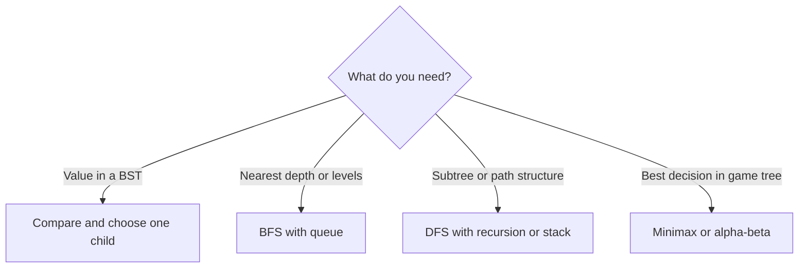

# Tree Search

## 1. Core idea

Tree search is a family of algorithms. The tree's properties determine the best strategy.



```text
Binary search tree lookup for 7:

		8          7 < 8 -> left
	   / \
	  3   10       7 > 3 -> right
	   \
		6          7 > 6 -> right
		 \
		  7        found
```

## 2. Choosing the search

| Tree or goal | Recommended algorithm |
| --- | --- |
| Balanced binary search tree lookup | Ordered BST search |
| Arbitrary tree value | DFS or BFS |
| Minimum depth | BFS |
| Subtree aggregates | Postorder DFS |
| Root-to-leaf paths | DFS or backtracking |

A BST search is $O(h)$, where $h$ is tree height. It is $O(\log n)$ only when the tree is balanced and can degrade to $O(n)$.

## 3. Python templates

```python
from __future__ import annotations

from dataclasses import dataclass


@dataclass
class TreeNode:
	value: int
	left: "TreeNode | None" = None
	right: "TreeNode | None" = None


def search_bst(root: TreeNode | None, target: int) -> TreeNode | None:
	current = root
	while current is not None:
		if current.value == target:
			return current
		current = current.left if target < current.value else current.right
	return None


root = TreeNode(8, TreeNode(3, right=TreeNode(6, right=TreeNode(7))), TreeNode(10))
print(search_bst(root, 7).value)  # 7
```

General DFS search does not assume ordering:

```python
from __future__ import annotations

from dataclasses import dataclass


@dataclass
class TreeNode:
	value: int
	children: list["TreeNode"]


def find_node(root: TreeNode | None, target: int) -> TreeNode | None:
	if root is None or root.value == target:
		return root
	for child in root.children:
		found = find_node(child, target)
		if found is not None:
			return found
	return None


root = TreeNode(1, [TreeNode(2, []), TreeNode(3, [TreeNode(4, [])])])
print(find_node(root, 4).value)  # 4
```

## 4. Complexity and recognition

| Search | Time | Extra space |
| --- | ---: | ---: |
| Balanced BST | $O(\log n)$ | $O(1)$ iterative |
| Worst-case BST | $O(n)$ | $O(1)$ iterative |
| General DFS | $O(n)$ | $O(h)$ |
| General BFS | $O(n)$ | $O(w)$ for maximum width |

Use ordering only when the problem guarantees the BST invariant. Otherwise, every node may need inspection.

## 5. Common mistakes

- Calling every tree lookup $O(\log n)$.
- Treating an arbitrary binary tree as a BST.
- Forgetting that recursive DFS uses $O(h)$ stack space.
- Choosing DFS for minimum depth when BFS can stop at the first leaf.
