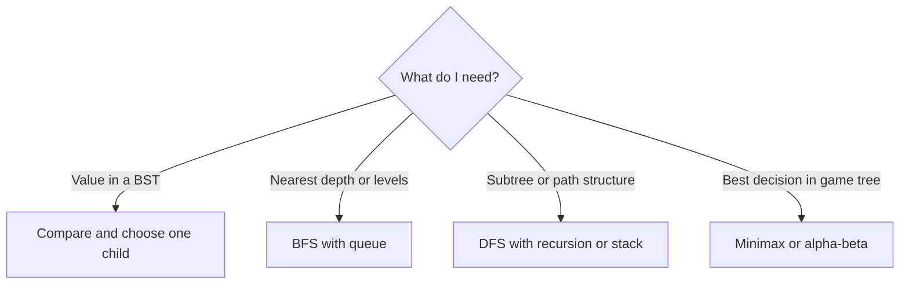

# Tree Search

## 1. How I think about it

Tree search is a family of algorithms. The tree's properties determine the best strategy.



```text
Binary search tree lookup for 7:

		8          7 < 8 -> left
	   / \
	  3   10       7 > 3 -> right
	   \
		6          7 > 6 -> right
		 \
		  7        found
```

## 2. How I choose the search

| Tree or goal | Recommended algorithm |
| --- | --- |
| Balanced binary search tree lookup | Ordered BST search |
| Arbitrary tree value | DFS or BFS |
| Minimum depth | BFS |
| Subtree aggregates | Postorder DFS |
| Root-to-leaf paths | DFS or backtracking |

A BST search is $O(h)$, where $h$ is tree height. It is $O(\log n)$ only when the tree is balanced and can degrade to $O(n)$.

## 3. My reusable base and common adaptations

### Generic template

The callbacks separate traversal from a particular node class.

```python
from collections.abc import Callable, Iterable
from typing import TypeVar

T = TypeVar("T")


def find_in_tree(
	root: T,
	children: Callable[[T], Iterable[T]],
	predicate: Callable[[T], bool],
):
	if predicate(root):
		return root
	for child in children(root):
		found = find_in_tree(child, children, predicate)
		if found is not None:
			return found
	return None
```

### Common adaptation 1: binary search tree lookup

```python
from dataclasses import dataclass


@dataclass
class TreeNode:
	value: int
	left: object = None
	right: object = None


def search_bst(root: TreeNode, target: int):
	current = root
	while current is not None:
		if current.value == target:
			return current
		current = current.left if target < current.value else current.right
	return None


root = TreeNode(8, TreeNode(3, right=TreeNode(6, right=TreeNode(7))), TreeNode(10))
print(search_bst(root, 7).value)  # 7
```

### Common adaptation 2: minimum tree depth with BFS

```python
from collections import deque
from dataclasses import dataclass


@dataclass
class TreeNode:
	value: int
	children: tuple = ()


def minimum_depth(root: TreeNode) -> int:
	queue = deque([(root, 1)])
	while queue:
		node, depth = queue.popleft()
		if not node.children:
			return depth
		queue.extend((child, depth + 1) for child in node.children)
	return 0


root = TreeNode(1, (TreeNode(2), TreeNode(3, (TreeNode(4),))))
print(minimum_depth(root))  # 2
```

## 4. Complexity and signals I look for

| Search | Time | Extra space |
| --- | ---: | ---: |
| Balanced BST | $O(\log n)$ | $O(1)$ iterative |
| Worst-case BST | $O(n)$ | $O(1)$ iterative |
| General DFS | $O(n)$ | $O(h)$ |
| General BFS | $O(n)$ | $O(w)$ for maximum width |

I rely on ordering only when the problem guarantees the BST invariant. Otherwise, I assume every node may need inspection.

## 5. Mistakes I watch for

- Calling every tree lookup $O(\log n)$.
- Treating an arbitrary binary tree as a BST.
- Forgetting that recursive DFS uses $O(h)$ stack space.
- Choosing DFS for minimum depth when BFS can stop at the first leaf.
