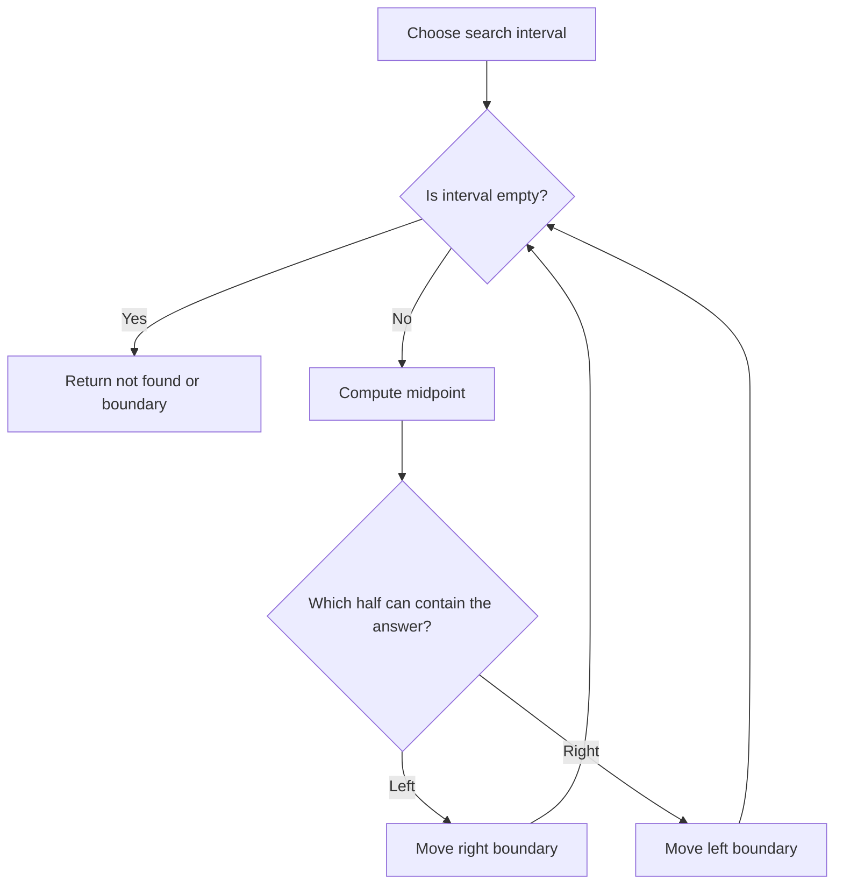

# Binary Search

## 1. How I think about it

Binary search repeatedly discards half of an ordered search space. It works when a condition is **monotonic**: once it becomes true, it stays true.

```text
values:  [1, 3, 4, 7, 9, 12, 15]   target = 9
indexes:  0  1  2  3  4   5   6
                       ^

[0 ................. 7)  mid = 3, value 7  -> search right
            [4 ..... 7)  mid = 5, value 12 -> search left
            [4)           value 9 found
```



## 2. What I need to preserve

- Exact-value search requires sorted input.
- Boundary search requires a monotonic predicate such as `False, False, True, True`.
- I choose one interval convention and preserve it throughout. The templates below use half-open intervals $[left, right)$.
- Each iteration must reduce the interval.

| Variant | Result | Typical use |
| --- | --- | --- |
| Exact search | Index of target or `-1` | Find a value in a sorted array |
| Lower bound | First index with value $\geq$ target | First valid position |
| Upper bound | First index with value $>$ target | Position after duplicates |
| Answer search | Smallest value satisfying a predicate | Minimize a feasible capacity |

## 3. My reusable templates

### Python: first true boundary

```python
from collections.abc import Callable


def first_true(left: int, right: int, condition: Callable[[int], bool]) -> int:
    """Return the first true index, or right if no such index exists."""
    while left < right:
        middle = left + (right - left) // 2
        if condition(middle):
            right = middle
        else:
            left = middle + 1
    return left


numbers = [1, 3, 4, 7, 9, 12, 15]
index = first_true(0, len(numbers), lambda position: numbers[position] >= 9)
print(index)  # 4
```

### Exact search

```python
def binary_search(numbers: list[int], target: int) -> int:
    left, right = 0, len(numbers) - 1

    while left <= right:
        middle = left + (right - left) // 2
        if numbers[middle] == target:
            return middle
        if numbers[middle] < target:
            left = middle + 1
        else:
            right = middle - 1

    return -1


print(binary_search([1, 3, 4, 7, 9], 7))  # 3
```

## 4. Complexity and signals I look for

| Measure | Complexity |
| --- | ---: |
| Time | $O(\log n)$ |
| Extra space, iterative | $O(1)$ |
| Extra space, recursive | $O(\log n)$ call stack |

Phrases that usually bring me back to binary search:

- "sorted array"
- "first" or "last" valid position
- "minimum possible maximum"
- "maximum possible minimum"
- a yes/no feasibility test that changes only once

## 5. Mistakes I watch for

- Applying binary search to a predicate that is not monotonic.
- Mixing closed intervals $[left, right]$ with half-open intervals $[left, right)$.
- Returning a boundary without checking whether it is inside the array.
- Moving a boundary to `middle` when that does not shrink the interval.
- Assuming the target exists.