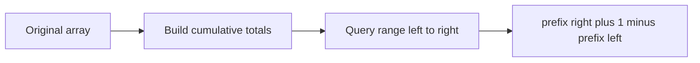

# Prefix Sum

## 1. Core idea

Prefix sums precompute cumulative totals so each range-sum query needs one subtraction.

```text
values:  [2, 4, 1, 7]
prefix: [0, 2, 6, 7, 14]

sum from index 1 through 3 = prefix[4] - prefix[1]
                           = 14 - 2 = 12
```



## 2. State and invariant

Define `prefix[i]` as the sum of the first $i$ values. The leading zero makes a half-open range $[left, right)$ equal to `prefix[right] - prefix[left]`.

| Goal | Formula |
| --- | --- |
| Sum of first $i$ values | `prefix[i]` |
| Half-open range $[l,r)$ | `prefix[r] - prefix[l]` |
| Inclusive range $[l,r]$ | `prefix[r + 1] - prefix[l]` |

## 3. Python templates

```python
def build_prefix_sum(values: list[int]) -> list[int]:
    prefix = [0]
    for value in values:
        prefix.append(prefix[-1] + value)
    return prefix


values = [2, 4, 1, 7]
prefix = build_prefix_sum(values)
left, right = 1, 3
print(prefix[right + 1] - prefix[left])  # 12
```

Prefix counts answer frequency queries:

```python
def vowel_prefix(text: str) -> list[int]:
    prefix = [0]
    for character in text:
        prefix.append(prefix[-1] + (character in "aeiou"))
    return prefix


prefix = vowel_prefix("algorithm")
print(prefix[5] - prefix[0])  # 2 vowels in "algor"
```

## 4. Complexity and recognition

| Phase | Time | Space |
| --- | ---: | ---: |
| Build | $O(n)$ | $O(n)$ |
| Each range query | $O(1)$ | $O(1)$ |
| $q$ queries total | $O(n + q)$ | $O(n)$ |

Look for many range-sum or range-count queries over an array that does not change. For updates, consider a Fenwick tree or segment tree.

## 5. Common mistakes

- Mixing inclusive and half-open indexes.
- Omitting the leading zero and adding boundary special cases.
- Rebuilding the prefix array for every query.
- Using ordinary prefix sums when values change between queries.
