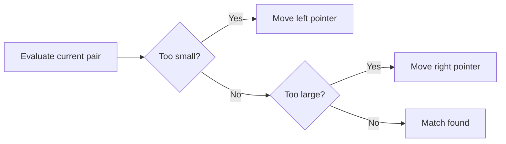

# Two Pointers

## 1. Core idea

Two pointers coordinate two positions instead of testing every pair. They may move toward each other, in the same direction, or at different speeds.

```text
Sorted pair sum, target = 8

[1, 2, 4, 6, 10]
 L           R       1 + 10 too large -> R moves left
 L        R          1 + 6 too small  -> L moves right
    L     R          2 + 6 = 8
```



## 2. Variants and invariants

| Variant | Movement | Typical use |
| --- | --- | --- |
| Opposite ends | Inward | Pair sum, palindrome |
| Same direction | Forward | Remove duplicates, partition |
| Fast and slow | Different speeds | Cycle or middle node |

Movement is valid only when ordering or another invariant proves that skipped candidates cannot be answers.

## 3. Python templates

```python
from __future__ import annotations


def pair_sum(numbers: list[int], target: int) -> tuple[int, int] | None:
    left, right = 0, len(numbers) - 1

    while left < right:
        total = numbers[left] + numbers[right]
        if total == target:
            return numbers[left], numbers[right]
        if total < target:
            left += 1
        else:
            right -= 1
    return None


print(pair_sum([1, 2, 4, 6, 10], 8))  # (2, 6)
```

In-place duplicate removal:

```python
def remove_duplicates(numbers: list[int]) -> int:
    if not numbers:
        return 0
    write = 1
    for read in range(1, len(numbers)):
        if numbers[read] != numbers[write - 1]:
            numbers[write] = numbers[read]
            write += 1
    return write


numbers = [1, 1, 2, 2, 3]
length = remove_duplicates(numbers)
print(numbers[:length])  # [1, 2, 3]
```

## 4. Complexity and recognition

| Pattern | Time | Extra space |
| --- | ---: | ---: |
| Opposite pointers | $O(n)$ | $O(1)$ |
| Read/write pointers | $O(n)$ | $O(1)$ |
| Nested scan avoided | Often $O(n)$ instead of $O(n^2)$ | $O(1)$ |

Look for sorted input, pair conditions, palindrome comparisons, in-place compaction, or linked-list cycle questions.

## 5. Common mistakes

- Applying pair-sum movement rules to unsorted data.
- Allowing both pointers to reference the same element when two are required.
- Moving the wrong pointer after comparing the current state.
- Forgetting that sorting first changes original indexes and costs $O(n \log n)$.
