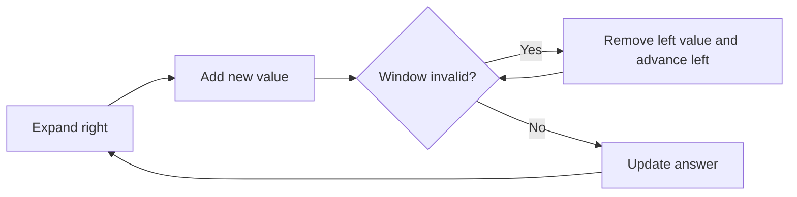

# Sliding Window

## 1. Core idea

A sliding window reuses information from a contiguous range instead of recomputing every range from scratch.

```text
values = [2, 1, 5, 1, 3, 2], k = 3

[2, 1, 5] 1, 3, 2  sum = 8
 2 [1, 5, 1] 3, 2  sum = 7
 2, 1 [5, 1, 3] 2  sum = 9
 2, 1, 5 [1, 3, 2] sum = 6
```



## 2. Window types

| Type | Boundary rule | Example |
| --- | --- | --- |
| Fixed size | Keep exactly $k$ elements | Maximum sum of length $k$ |
| Variable size | Shrink while invalid | Longest unique substring |
| Monotonic window | Keep useful candidates | Maximum of every window |

The maintained state must be updated when both entering and leaving values cross the boundaries.

## 3. Python templates

```python
def maximum_window_sum(values: list[int], size: int) -> int:
    if size <= 0 or size > len(values):
        raise ValueError("invalid window size")
    current = sum(values[:size])
    best = current

    for right in range(size, len(values)):
        current += values[right] - values[right - size]
        best = max(best, current)
    return best


print(maximum_window_sum([2, 1, 5, 1, 3, 2], 3))  # 9
```

```python
def longest_unique_substring(text: str) -> int:
    last_seen = {}
    left = best = 0

    for right, character in enumerate(text):
        if character in last_seen and last_seen[character] >= left:
            left = last_seen[character] + 1
        last_seen[character] = right
        best = max(best, right - left + 1)
    return best


print(longest_unique_substring("abcabcbb"))  # 3
```

## 4. Complexity and recognition

| Approach | Time | Extra space |
| --- | ---: | ---: |
| Fixed numeric window | $O(n)$ | $O(1)$ |
| Variable window with map | $O(n)$ | $O(k)$ |

Look for contiguous subarrays or substrings, longest or shortest valid ranges, and repeated calculations over neighboring windows.

## 5. Common mistakes

- Using a variable-size sum window without verifying monotonicity; negative values can invalidate common expand/shrink rules, but fixed-size windows are unaffected.
- Updating the answer before the window is valid.
- Forgetting to remove outgoing state.
- Confusing a contiguous window with a subsequence.
