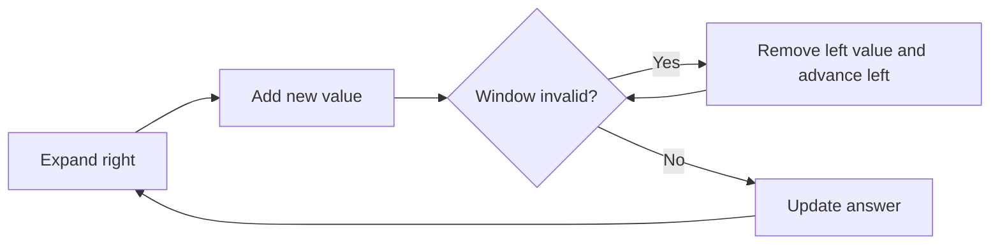

# Sliding Window

## 1. How I think about it

A sliding window reuses information from a contiguous range instead of recomputing every range from scratch.

Consider using the sliding window pattern for questions that involve searching for a continuous subarray/substring in an array or string that satisfies a certain constraint.

If you know the length of the subarray/substring you are looking for, use a fixed-length sliding window. Otherwise, use a variable-length sliding window.

Examples:
- Finding the largest substring without repeating characters in a given string (variable-length).
- Finding the largest substring containing a single character that can be made by replacing at most k characters in a given string (variable-length).
- Finding the largest sum of a subarray of size k without duplicate elements in a given array (fixed-length).

```text
values = [2, 1, 5, 1, 3, 2], k = 3

[2, 1, 5] 1, 3, 2  sum = 8
 2 [1, 5, 1] 3, 2  sum = 7
 2, 1 [5, 1, 3] 2  sum = 9
 2, 1, 5 [1, 3, 2] sum = 6
```


```mermaid
flowchart LR
    A[Expand right] --> B[Add new value]
    B --> C{Window invalid?}
    C -- Yes --> D[Remove left value and advance left]
    D --> C
    C -- No --> E[Update answer]
    E --> A
```


## Template


```python
def sliding_window(arr):
    left = 0
    max_or_min_length = # (0 for max, float('inf') for min)
    window_state = # (ej: dict/set for sum or couting frequency)
    
    for right in range(len(arr)):
        window_state.add(arr[right])
        
        while window_condition_is_invalid(window_state):
            window_state.remove(arr[left])
            left += 1
            
        current_window_len = right - left + 1
        max_or_min_length = max(max_or_min_length, current_window_len)
        
    return max_or_min_length
```

```python
def fixed_sliding_window(arr, k):
    current_val = sum(arr[:k])
    max_or_min_val = current_val # best result at moment
    
    for right in range(k, len(arr)):
        element_in = arr[right]
        element_out = arr[right - k]
        
        # update window O(1)
        current_val += element_in - element_out
        
        max_or_min_val = max(max_or_min_val, current_val)
        
    return max_or_min_val
```


## 3. Examples

### 3.1 longest unique substring

```python
def longest_unique_substring(text: str) -> int:
    window = set()
    left = best = 0

    for right, character in enumerate(text):
        while character in window:
            window.remove(text[left])
            left += 1
        window.add(character)
        best = max(best, right - left + 1)
    return best


print(longest_unique_substring("abcabcbb"))  # 3
```

## 4. Complexity

| Approach | Time | Extra space |
| --- | ---: | ---: |
| Fixed numeric window | $O(n)$ | $O(1)$ |
| Variable window with map | $O(n)$ | $O(k)$ |

Contiguous subarrays or substrings, longest or shortest valid ranges, and repeated calculations over neighboring windows are the signals I look for.

## 5. Mistakes I watch for

- Using a variable-size sum window without verifying monotonicity; negative values can invalidate common expand/shrink rules, but fixed-size windows are unaffected.
- Updating the answer before the window is valid.
- Forgetting to remove outgoing state.
- Confusing a contiguous window with a subsequence.
