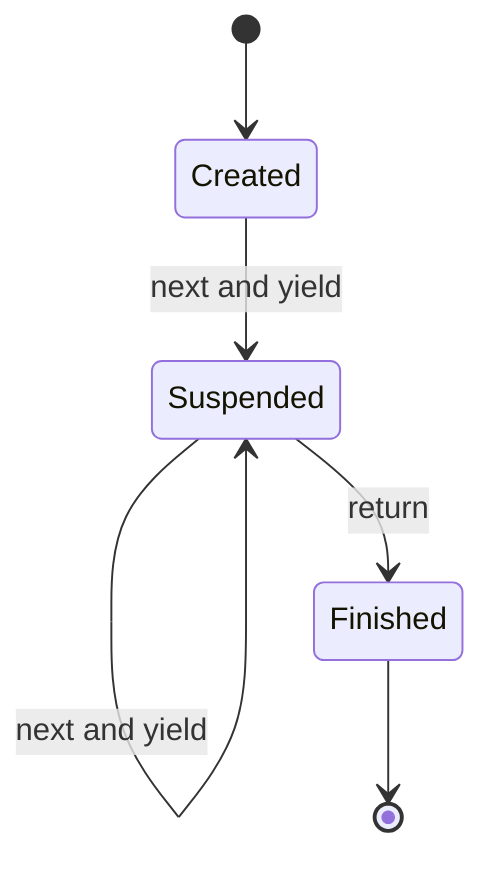

# Generators

## 1. How I think about it

A Python generator produces values lazily with `yield`. It pauses after each value and resumes with its local state intact.

```text
function call -> generator object
next()        -> yield first value -> pause
next()        -> yield next value  -> pause
iteration end -> StopIteration
```



Generators are a language technique, not a search or sorting algorithm. They are valuable for streaming algorithm results without storing every value.

## 2. The execution model I keep in mind

| Concept | Meaning |
| --- | --- |
| `yield value` | Produce one value and suspend |
| `next(generator)` | Resume until the next yield |
| `for value in generator` | Consume until completion |
| `yield from iterable` | Delegate iteration |
| Generator expression | Lazy form such as `(x * x for x in values)` |

A generator is generally single-use: once exhausted, create a new generator to iterate again.

## 3. My reusable base and common adaptations

### Generic template

```python
from collections.abc import Callable, Iterable, Iterator
from typing import TypeVar

T = TypeVar("T")
U = TypeVar("U")


def lazy_map(values: Iterable[T], transform: Callable[[T], U]) -> Iterator[U]:
    for value in values:
        yield transform(value)
```

### Common adaptation 1: lazy filtering pipeline

```python
def where(values, predicate):
    for value in values:
        if predicate(value):
            yield value


even_squares = (value * value for value in where(range(10), lambda value: value % 2 == 0))
print(list(even_squares))  # [0, 4, 16, 36, 64]
```

### Common adaptation 2: lazy backtracking results

```python
def subsets(values: list[int]):
    current = []

    def generate(index: int):
        if index == len(values):
            yield current.copy()
            return
        current.append(values[index])
        yield from generate(index + 1)
        current.pop()
        yield from generate(index + 1)

    yield from generate(0)


print(list(subsets([1, 2])))  # [[1, 2], [1], [2], []]
```

## 4. Complexity and signals I look for

A generator changes when memory is allocated, not necessarily the total work.

| Operation | Cost |
| --- | ---: |
| Create generator object | $O(1)$ |
| Produce next value | Depends on work until next `yield` |
| Store generator state | Usually $O(1)$ plus referenced state |
| Materialize with `list(...)` | Time to produce all outputs; space equals total output size |

I reach for generators with large streams, pipelines, tree traversals, combinatorial results, and early termination when I may consume only part of the output.

For example, the subsets generator produces $2^n$ lists with $O(n2^n)$ total payload in the worst case. Converting it to a list therefore requires exponential time and space.

## 5. Mistakes I watch for

- Expecting the function body to run when the generator is created.
- Attempting to iterate an exhausted generator again.
- Calling `list(generator)` and losing the memory advantage.
- Yielding the same mutable object repeatedly without copying it.
- Assuming laziness reduces the algorithm's total time complexity.
