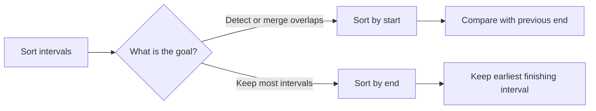

# Intervals

## 1. How I think about it

An interval represents a continuous range as `[start, end]`. Most interval problems become easier after sorting because each interval only needs to be compared with the last relevant interval.

```text
Sorted by start:

[1, 3] [2, 6] [8, 10]
         ^
2 <= 3, so the first two intervals overlap

Merged result: [1, 6] [8, 10]
```




### 1.1 Sorting by Start Time
Detect overlaps, merge intervals

-  Overlapping intervals: After sorting by start time, an interval overlaps with the previous interval if it starts before the end time of the previous interval.

```python
def canAttendMeetings(intervals):
    if not intervals:
        return True
    
    intervals.sort(key=lambda x: x[0])
    
    for i in range(1, len(intervals)):
        if intervals[i][0] < intervals[i-1][1]:
            return False
    
    return True
```

- Merging Intervals: When an interval overlaps with the previous interval in a list of intervals sorted by start times, they can be merged into a single interval. To merge an interval into a previous interval, we set the end time of the previous interval to be the max of either end time

```
prev_interval[1] = max(prev_interval[1], interval[1])
```

```python
def mergeIntervals(intervals):
    sortedIntervals = sorted(intervals, key=lambda x: x[0])
    merged = []
        
    for interval in sortedIntervals:
        if not merged or interval[0] > merged[-1][1]:
            merged.append(interval)
        else:
            merged[-1][1] = max(interval[1], merged[-1][1])

    return merged
```

### 1.2 Sorting by End Time
Maximun non-overlapping intervals

- Non-Overlapping Intervals: Let's consider the question of finding the maximum number of non-overlapping intervals in a given list of intervals, our solution will sort the intervals, and then greedily try to add each interval to the set of non-overlapping intervals. 
If we sort by start time, we risk adding an interval that starts early but ends late, which will block us from adding other intervals until that interval ends, but if instead we sort by end time, we can start by adding the intervals that end the earliest. Intuitively, this frees time for us to add more intervals as early as possible, and yields the correct answer.

```python
def nonOverlappingIntervals(intervals):
    if not intervals:
        return 0

    intervals.sort(key=lambda x: x[1])

    end = intervals[0][1]
    count = 1

    for i in range(1, len(intervals)):
        # Non-overlapping interval found
        if intervals[i][0] >= end:
            end = intervals[i][1]
            count += 1

    return len(intervals) - count
```

## 2. Examples

### 2.1 Meeting attendance

```python
def can_attend_meetings(intervals):
    sorted_intervals = sorted(intervals, key=lambda interval: interval[0])

    for index in range(1, len(sorted_intervals)):
        current_start = sorted_intervals[index][0]
        previous_end = sorted_intervals[index - 1][1]

        if current_start < previous_end:
            return False

    return True


print(can_attend_meetings([[0, 30], [5, 10], [15, 20]]))  # False
print(can_attend_meetings([[7, 10], [10, 12]]))  # True
```

### 2.2 Insert an interval

When the original intervals are already sorted and non-overlapping, insertion can be done in one pass:

```python
def insert_interval(intervals, new_interval):
    result = []
    index = 0

    while index < len(intervals) and intervals[index][1] < new_interval[0]:
        result.append(intervals[index])
        index += 1

    while index < len(intervals) and intervals[index][0] <= new_interval[1]:
        new_interval[0] = min(new_interval[0], intervals[index][0])
        new_interval[1] = max(new_interval[1], intervals[index][1])
        index += 1

    result.append(new_interval)
    result.extend(intervals[index:])
    return result


print(insert_interval([[1, 3], [6, 9]], [2, 5]))  # [[1, 5], [6, 9]]
```

### 2.3 Minimum intervals to remove

```python
def minimum_intervals_to_remove(intervals):
    kept = maximum_non_overlapping(intervals)
    return len(intervals) - kept


print(minimum_intervals_to_remove([[1, 2], [2, 3], [3, 4], [1, 3]]))  # 1
```


## 4. Complexity

| Approach | Time | Extra space |
| --- | ---: | ---: |
| Detect overlaps after sorting | $O(n \log n)$ | $O(n)$ with `sorted` |
| Merge intervals | $O(n \log n)$ | $O(n)$ for the result |
| Select maximum non-overlapping | $O(n \log n)$ | $O(n)$ with `sorted` |
| Insert into sorted, non-overlapping intervals | $O(n)$ | $O(n)$ for the result |

Sorting is usually the dominant cost. The scan after sorting is $O(n)$.

## 5. Mistakes I watch for

- Sorting by start time when the goal is to keep the maximum number of intervals; that greedy strategy requires sorting by end time.
- Comparing only with the immediately previous input interval when merging; compare with the last merged interval instead.
- Using `<` when touching endpoints overlap, or `<=` when back-to-back intervals are allowed.
- Forgetting to update the end after merging or selecting an interval.
- Assuming the input is sorted or non-overlapping when the problem does not guarantee it.
- Mutating the input intervals unintentionally while building the result.
- Returning the number kept when the question asks for the number removed.