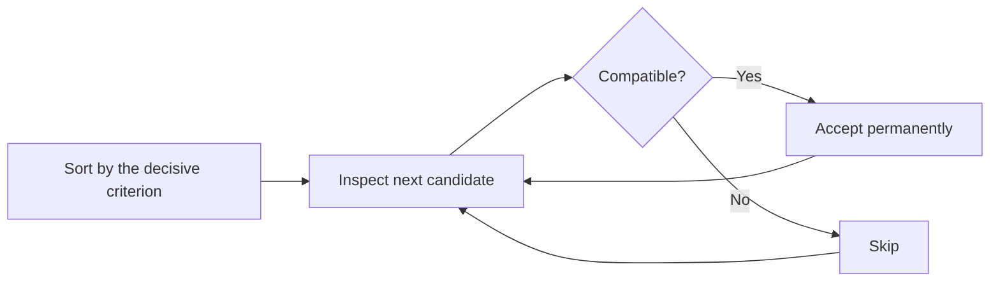

# Greedy

## 1. Core idea

A greedy algorithm makes the best local choice and never revisits it. It is correct only when the problem has a greedy-choice property and optimal substructure.

```text
Select the maximum number of non-overlapping intervals:

intervals sorted by finish: (1,3), (2,5), (4,7), (6,9), (8,10)
choose (1,3)
skip   (2,5)
choose (4,7)
skip   (6,9)
choose (8,10)
```



## 2. Correctness strategy

A greedy choice needs proof. Common proof styles are:

| Proof style | Idea |
| --- | --- |
| Exchange argument | Replace an optimal choice with the greedy one without worsening the answer |
| Staying ahead | Show the greedy partial solution is never worse |
| Cut property | The lightest valid crossing edge is safe, as in MST algorithms |

A locally attractive decision is not enough by itself.

## 3. Python templates

```python
def maximum_non_overlapping(intervals: list[tuple[int, int]]) -> list[tuple[int, int]]:
    selected = []
    last_end = float("-inf")

    for start, end in sorted(intervals, key=lambda interval: interval[1]):
        if start >= last_end:
            selected.append((start, end))
            last_end = end
    return selected


intervals = [(1, 3), (2, 5), (4, 7), (6, 9), (8, 10)]
print(maximum_non_overlapping(intervals))  # [(1, 3), (4, 7), (8, 10)]
```

Generic selection skeleton:

```python
def greedy_select(candidates, priority, is_valid):
    result = []
    for candidate in sorted(candidates, key=priority):
        if is_valid(result, candidate):
            result.append(candidate)
    return result


values = [5, 1, 3]
print(greedy_select(values, priority=lambda value: value, is_valid=lambda result, value: True))
```

## 4. Complexity and recognition

Greedy algorithms are often dominated by sorting: $O(n \log n)$ time, followed by an $O(n)$ scan. Heap-based greedy algorithms may perform $O(\log n)$ work per choice.

Look for interval scheduling, minimum spanning trees, Huffman coding, deadline scheduling, and problems asking for a maximum count under compatibility constraints.

## 5. Common mistakes

- Choosing an intuitive rule without proving it.
- Sorting by the wrong field, such as interval start instead of finish.
- Using greedy for 0/1 knapsack, where local value ratios are insufficient.
- Mutating caller-owned input without documenting that sorting is in place.
- Confusing a heuristic that often works with a guaranteed greedy algorithm.
