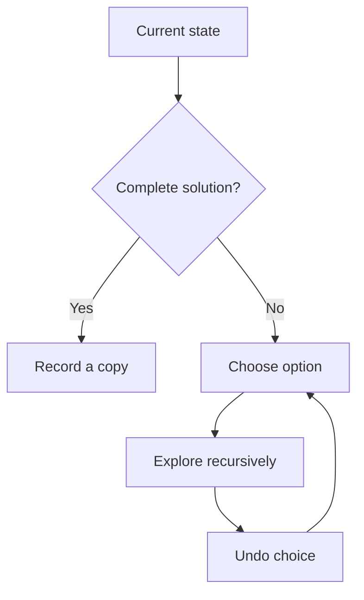

# Backtracking

## 1. How I think about it

Backtracking builds a candidate, explores it, and undoes the decision before trying the next option.

```text
subsets of [1, 2]

                 []
              /      \
          choose 1   skip 1
           [1]          []
          /   \        /  \
      [1,2]   [1]    [2]   []
```



## 2. How I model the state and decisions

A backtracking solution usually has:

- State: the partial candidate.
- Choices: available next decisions.
- Constraints: rules used to prune invalid branches.
- Goal: the condition for recording a solution.

| Problem | State | Choices |
| --- | --- | --- |
| Subsets | Current subset | Include or skip |
| Permutations | Current ordering | Any unused value |
| Combination sum | Current sum | Allowed candidate values |
| Grid word search | Position and matched prefix | Neighboring cells |

## 3. My reusable base and common adaptations

### Generic template

`apply` mutates the state and `undo` restores it after the recursive branch.

```python
def backtrack(state, choices, is_complete, apply, undo, record) -> None:
    if is_complete(state):
        record(state)
        return

    for choice in choices(state):
        apply(state, choice)
        backtrack(state, choices, is_complete, apply, undo, record)
        undo(state, choice)
```

### Common adaptation 1: permutations

```python
def permutations(values: list[int]) -> list[list[int]]:
    result, current, used = [], [], [False] * len(values)

    def search() -> None:
        if len(current) == len(values):
            result.append(current.copy())
            return
        for index, value in enumerate(values):
            if not used[index]:
                used[index] = True
                current.append(value)
                search()
                current.pop()
                used[index] = False

    search()
    return result


print(permutations([1, 2]))  # [[1, 2], [2, 1]]
```

### Common adaptation 2: N-Queens

```python
def solve_n_queens(size: int) -> list[list[int]]:
    solutions, columns = [], []

    def search(row: int) -> None:
        if row == size:
            solutions.append(columns.copy())
            return
        for column in range(size):
            if all(column != placed and abs(column - placed) != row - previous
                   for previous, placed in enumerate(columns)):
                columns.append(column)
                search(row + 1)
                columns.pop()

    search(0)
    return solutions


print(len(solve_n_queens(4)))  # 2
```

## 4. Complexity and signals I look for

Backtracking complexity follows the size of the decision tree. If each level has $b$ choices and depth $d$, the upper bound is often $O(b^d)$ before pruning.

| Technique | Effect |
| --- | --- |
| Constraint pruning | Stops impossible branches |
| Sorting choices | Enables duplicate skipping or early stopping |
| Memoization | Avoids repeated equivalent states |

"Generate all," permutations, combinations, arrangements, paths, and constraint satisfaction are the phrases that bring me back to backtracking.

## 5. Mistakes I watch for

- Appending `current` instead of `current.copy()` to the result.
- Forgetting to undo a choice.
- Mutating shared state inconsistently across branches.
- Recording partial states when only complete solutions are valid.
- Omitting pruning that the constraints make possible.
