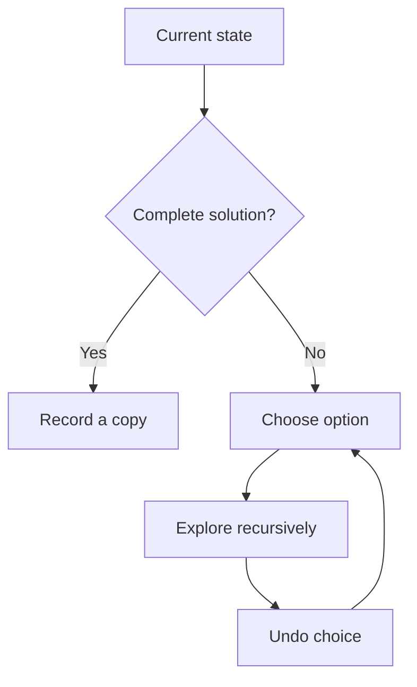

# Backtracking

## 1. Core idea

Backtracking builds a candidate, explores it, and undoes the decision before trying the next option.

```text
subsets of [1, 2]

                 []
              /      \
          choose 1   skip 1
           [1]          []
          /   \        /  \
      [1,2]   [1]    [2]   []
```



## 2. State and decision tree

A backtracking solution usually has:

- State: the partial candidate.
- Choices: available next decisions.
- Constraints: rules used to prune invalid branches.
- Goal: the condition for recording a solution.

| Problem | State | Choices |
| --- | --- | --- |
| Subsets | Current subset | Include or skip |
| Permutations | Current ordering | Any unused value |
| Combination sum | Current sum | Allowed candidate values |
| Grid word search | Position and matched prefix | Neighboring cells |

## 3. Python templates

```python
def subsets(values: list[int]) -> list[list[int]]:
    result = []
    current = []

    def search(index: int) -> None:
        if index == len(values):
            result.append(current.copy())
            return

        current.append(values[index])
        search(index + 1)
        current.pop()
        search(index + 1)

    search(0)
    return result


print(subsets([1, 2]))  # [[1, 2], [1], [2], []]
```

Reusable skeleton:

```python
def backtrack(state, choices, is_complete, record):
    if is_complete(state):
        record(state.copy())
        return

    for choice in choices(state):
        state.append(choice)       # choose
        backtrack(state, choices, is_complete, record)
        state.pop()                # undo
```

## 4. Complexity and recognition

Backtracking complexity follows the size of the decision tree. If each level has $b$ choices and depth $d$, the upper bound is often $O(b^d)$ before pruning.

| Technique | Effect |
| --- | --- |
| Constraint pruning | Stops impossible branches |
| Sorting choices | Enables duplicate skipping or early stopping |
| Memoization | Avoids repeated equivalent states |

Look for "generate all," permutations, combinations, arrangements, paths, and constraint-satisfaction problems.

## 5. Common mistakes

- Appending `current` instead of `current.copy()` to the result.
- Forgetting to undo a choice.
- Mutating shared state inconsistently across branches.
- Recording partial states when only complete solutions are valid.
- Omitting pruning that the constraints make possible.
