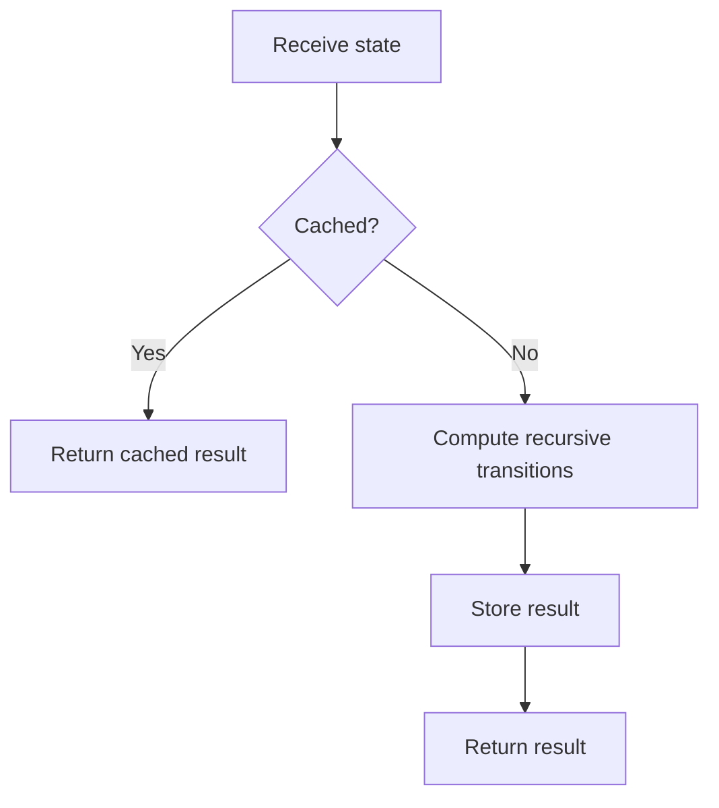

# Memoization

## 1. How I think about it

Memoization is top-down dynamic programming. A recursive function caches the result for each state and returns it when the same state appears again.

```text
fib(5)
├── fib(4)
│   ├── fib(3)
│   └── fib(2)
└── fib(3)       <- reuse cached result
```



## 2. How I design the cache

The cache key must include every value that can change the answer.

| State example | Suitable key |
| --- | --- |
| Position in array | `index` |
| Position and remaining budget | `(index, remaining)` |
| Grid position | `(row, column)` |
| Two-string alignment | `(first_index, second_index)` |

Memoization avoids repeated states; it does not reduce the number of genuinely distinct states.

## 3. My reusable base and common adaptations

### Generic template

```python
def memoized_search(start_state, is_base, base_value, transitions, combine):
    memo = {}

    def search(state):
        if state in memo:
            return memo[state]
        if is_base(state):
            return base_value(state)

        child_results = [search(next_state) for next_state in transitions(state)]
        memo[state] = combine(state, child_results)
        return memo[state]

    return search(start_state)
```

### Common adaptation 1: Fibonacci

```python
from functools import cache


@cache
def fibonacci(number: int) -> int:
    if number < 2:
        return number
    return fibonacci(number - 1) + fibonacci(number - 2)


print(fibonacci(10))  # 55
```

### Common adaptation 2: grid path counting

```python
from functools import cache


def count_grid_paths(rows: int, columns: int) -> int:
    @cache
    def paths(row: int, column: int) -> int:
        if row == rows - 1 and column == columns - 1:
            return 1
        if row >= rows or column >= columns:
            return 0
        return paths(row + 1, column) + paths(row, column + 1)

    return paths(0, 0)


print(count_grid_paths(3, 3))  # 6
```

## 4. Complexity and signals I look for

If there are $S$ reachable states and each evaluates $T$ transitions, memoization usually takes $O(ST)$ time and $O(S)$ cache space, plus recursion stack space.

| Prefer memoization when | Prefer tabulation when |
| --- | --- |
| Only some states are reachable | Nearly all states are needed |
| Recursive transitions are clearer | Iteration order is simple |
| State graph is irregular | Recursion depth is dangerous |

## 5. Mistakes I watch for

- Leaving part of the state out of the cache key.
- Caching mutable objects as keys.
- Caching after recursive calls but forgetting early cache lookup.
- Returning a mutable cached result and modifying it elsewhere.
- Ignoring Python's recursion limit for deep state graphs.
