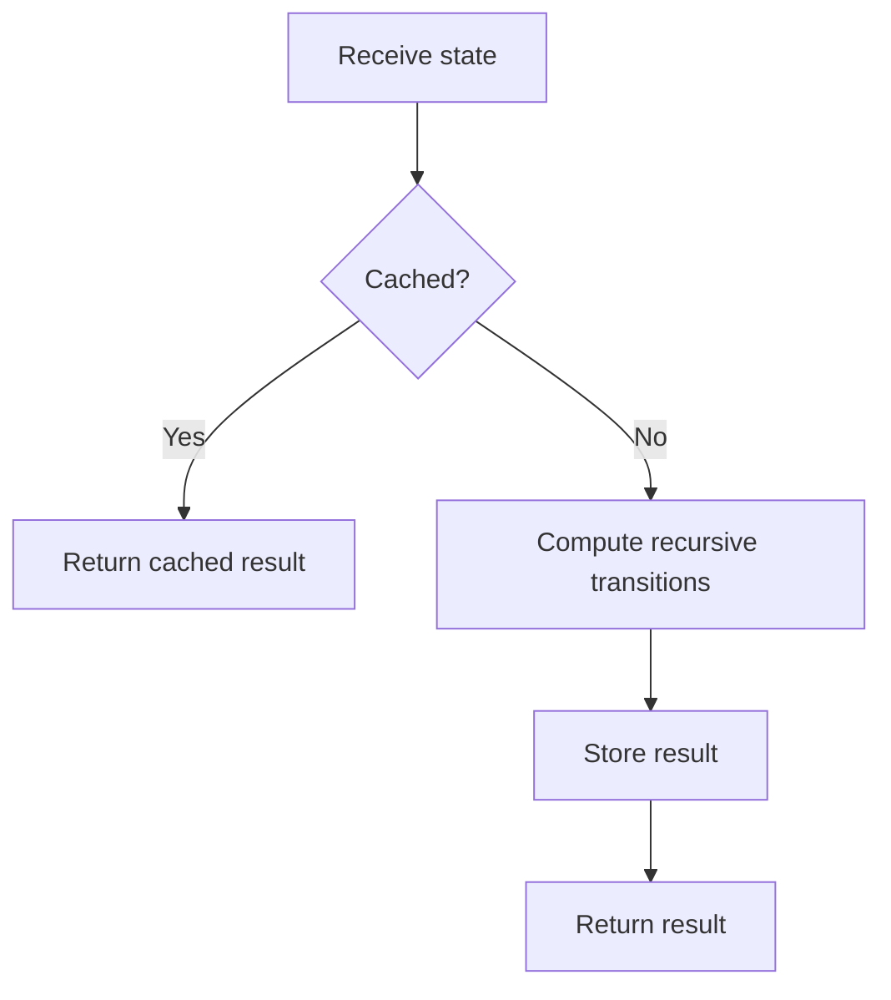

# Memoization

## 1. Core idea

Memoization is top-down dynamic programming. A recursive function caches the result for each state and returns it when the same state appears again.

```text
fib(5)
├── fib(4)
│   ├── fib(3)
│   └── fib(2)
└── fib(3)       <- reuse cached result
```



## 2. Cache design

The cache key must include every value that can change the answer.

| State example | Suitable key |
| --- | --- |
| Position in array | `index` |
| Position and remaining budget | `(index, remaining)` |
| Grid position | `(row, column)` |
| Two-string alignment | `(first_index, second_index)` |

Memoization avoids repeated states; it does not reduce the number of genuinely distinct states.

## 3. Python templates

```python
from functools import cache


@cache
def fibonacci(number: int) -> int:
    if number < 2:
        return number
    return fibonacci(number - 1) + fibonacci(number - 2)


print(fibonacci(10))  # 55
```

Reusable explicit-cache skeleton:

```python
def solve(start_state):
    memo = {}

    def search(state):
        if state in memo:
            return memo[state]
        if state == 0:
            return 1

        answer = search(state - 1)
        memo[state] = answer
        return answer

    return search(start_state)


print(solve(5))  # 1
```

## 4. Complexity and recognition

If there are $S$ reachable states and each evaluates $T$ transitions, memoization usually takes $O(ST)$ time and $O(S)$ cache space, plus recursion stack space.

| Prefer memoization when | Prefer tabulation when |
| --- | --- |
| Only some states are reachable | Nearly all states are needed |
| Recursive transitions are clearer | Iteration order is simple |
| State graph is irregular | Recursion depth is dangerous |

## 5. Common mistakes

- Leaving part of the state out of the cache key.
- Caching mutable objects as keys.
- Caching after recursive calls but forgetting early cache lookup.
- Returning a mutable cached result and modifying it elsewhere.
- Ignoring Python's recursion limit for deep state graphs.
