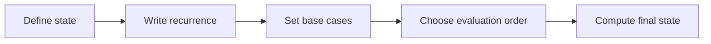

# Dynamic Programming

## 1. Core idea

Dynamic programming solves overlapping subproblems once and combines their answers. It requires a state definition, a recurrence, base cases, and an evaluation order.

```text
climb stairs, n = 5

dp[0] = 1
dp[1] = 1
dp[2] = dp[1] + dp[0] = 2
dp[3] = dp[2] + dp[1] = 3
dp[4] = dp[3] + dp[2] = 5
dp[5] = dp[4] + dp[3] = 8
```



## 2. State design

A useful state contains only the information required to determine future decisions.

| Question | Example answer |
| --- | --- |
| What does `dp[i]` mean? | Number of ways to reach step $i$ |
| What are the base cases? | `dp[0] = dp[1] = 1` |
| How do states relate? | `dp[i] = dp[i - 1] + dp[i - 2]` |
| In what order are they computed? | Increasing index |

## 3. Python templates

```python
def climb_stairs(steps: int) -> int:
    if steps <= 1:
        return 1

    previous, current = 1, 1
    for _ in range(2, steps + 1):
        previous, current = current, previous + current
    return current


print(climb_stairs(5))  # 8
```

A general one-dimensional tabulation skeleton:

```python
def minimum_cost(costs: list[int]) -> int:
    """Return the minimum cost to move beyond the last non-negative-cost step."""
    if len(costs) <= 1:
        return 0

    dp = [0] * len(costs)
    dp[0], dp[1] = costs[0], costs[1]
    for index in range(2, len(costs)):
        dp[index] = costs[index] + min(dp[index - 1], dp[index - 2])
    return min(dp[-1], dp[-2])


print(minimum_cost([10, 15, 20]))  # 15
```

## 4. Complexity and recognition

| Design | Time | Space |
| --- | ---: | ---: |
| $n$ states, $O(1)$ transition | $O(n)$ | $O(n)$ |
| Space-optimized previous states | $O(n)$ | $O(1)$ |
| $n \times m$ states | Usually $O(nm)$ | Usually $O(nm)$ |

Look for optimization, counting, or feasibility problems with repeated subproblems and optimal substructure. Common examples include knapsack, edit distance, longest subsequences, grid paths, and interval DP.

## 5. Common mistakes

- Defining a state that omits information needed by future decisions.
- Computing states before their dependencies.
- Using an incorrect impossible-state sentinel.
- Optimizing space before the recurrence is correct.
- Calling any recursion DP even when subproblems do not overlap.
